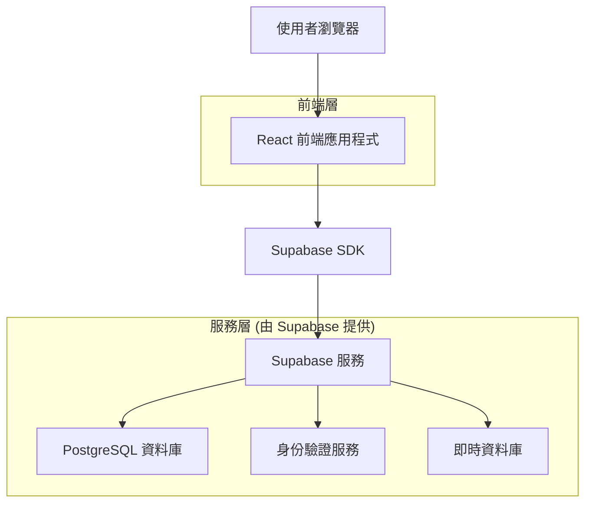
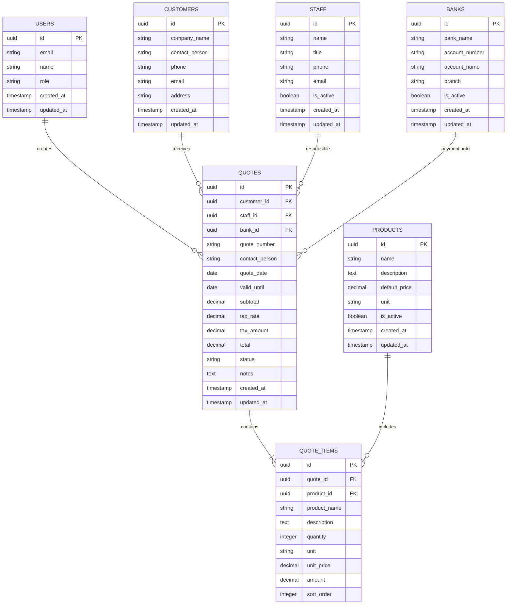

# 報價單系統技術架構文件

## 1. 架構設計



## 2. 技術描述

* **前端**：React\@18 + TypeScript + Tailwind CSS + Vite

* **後端**：Supabase (PostgreSQL + 身份驗證 + 即時功能)

* **UI 元件庫**：Headless UI + Heroicons

* **表單處理**：React Hook Form + Zod 驗證

* **狀態管理**：Zustand

* **PDF 生成**：jsPDF + html2canvas

* **部署平台**：Vercel

## 3. 路由定義

| 路由                  | 用途                  |
| ------------------- | ------------------- |
| /                   | 首頁，顯示系統概覽和快速操作      |
| /login              | 登入頁面，使用者身份驗證        |
| /quotes             | 報價單管理頁面，顯示所有報價單列表   |
| /quotes/new         | 新增報價單頁面，建立新的報價單     |
| /quotes/:id         | 報價單詳細頁面，查看特定報價單     |
| /quotes/:id/edit    | 編輯報價單頁面，修改現有報價單     |
| /quotes/:id/preview | 報價單預覽頁面，列印和匯出功能     |
| /settings           | 基礎資料管理頁面，管理客戶、產品等資料 |
| /settings/customers | 客戶資料管理              |
| /settings/products  | 產品資料管理              |
| /settings/banks     | 匯款資料管理              |
| /settings/staff     | 專案負責人管理             |

## 4. API 定義

### 4.1 核心 API

**報價單相關**

```typescript
// 取得報價單列表
GET /api/quotes
```

查詢參數：

| 參數名稱         | 參數類型   | 是否必填  | 描述                                     |
| ------------ | ------ | ----- | -------------------------------------- |
| page         | number | false | 頁碼，預設為 1                               |
| limit        | number | false | 每頁筆數，預設為 10                            |
| customer\_id | string | false | 客戶 ID 篩選                               |
| status       | string | false | 狀態篩選 (draft, sent, accepted, rejected) |
| date\_from   | string | false | 開始日期 (YYYY-MM-DD)                      |
| date\_to     | string | false | 結束日期 (YYYY-MM-DD)                      |

回應：

| 參數名稱  | 參數類型     | 描述    |
| ----- | -------- | ----- |
| data  | Quote\[] | 報價單陣列 |
| total | number   | 總筆數   |
| page  | number   | 當前頁碼  |
| limit | number   | 每頁筆數  |

```typescript
// 建立報價單
POST /api/quotes
```

請求：

| 參數名稱            | 參數類型         | 是否必填  | 描述       |
| --------------- | ------------ | ----- | -------- |
| customer\_id    | string       | true  | 客戶 ID    |
| contact\_person | string       | true  | 聯絡人      |
| quote\_date     | string       | true  | 報價日期     |
| valid\_until    | string       | true  | 有效期限     |
| items           | QuoteItem\[] | true  | 報價項目陣列   |
| tax\_rate       | number       | false | 稅率，預設 5% |
| notes           | string       | false | 備註       |
| staff\_id       | string       | true  | 負責人 ID   |
| bank\_id        | string       | true  | 匯款資料 ID  |

**客戶資料相關**

```typescript
// 取得客戶列表
GET /api/customers
```

回應：

| 參數名稱            | 參數類型   | 描述    |
| --------------- | ------ | ----- |
| id              | string | 客戶 ID |
| company\_name   | string | 公司名稱  |
| contact\_person | string | 聯絡人   |
| phone           | string | 電話    |
| email           | string | 電子郵件  |
| address         | string | 地址    |

## 5. 資料模型

### 5.1 資料模型定義



### 5.2 資料定義語言

**使用者表 (users)**

```sql
-- 建立表格
CREATE TABLE users (
    id UUID PRIMARY KEY DEFAULT gen_random_uuid(),
    email VARCHAR(255) UNIQUE NOT NULL,
    name VARCHAR(100) NOT NULL,
    role VARCHAR(20) DEFAULT 'user' CHECK (role IN ('admin', 'user')),
    created_at TIMESTAMP WITH TIME ZONE DEFAULT NOW(),
    updated_at TIMESTAMP WITH TIME ZONE DEFAULT NOW()
);

-- 建立索引
CREATE INDEX idx_users_email ON users(email);
CREATE INDEX idx_users_role ON users(role);

-- 設定權限
GRANT SELECT ON users TO anon;
GRANT ALL PRIVILEGES ON users TO authenticated;
```

**客戶表 (customers)**

```sql
-- 建立表格
CREATE TABLE customers (
    id UUID PRIMARY KEY DEFAULT gen_random_uuid(),
    company_name VARCHAR(200) NOT NULL,
    contact_person VARCHAR(100) NOT NULL,
    phone VARCHAR(20),
    email VARCHAR(255),
    address TEXT,
    created_at TIMESTAMP WITH TIME ZONE DEFAULT NOW(),
    updated_at TIMESTAMP WITH TIME ZONE DEFAULT NOW()
);

-- 建立索引
CREATE INDEX idx_customers_company_name ON customers(company_name);
CREATE INDEX idx_customers_contact_person ON customers(contact_person);

-- 設定權限
GRANT SELECT ON customers TO anon;
GRANT ALL PRIVILEGES ON customers TO authenticated;
```

**產品表 (products)**

```sql
-- 建立表格
CREATE TABLE products (
    id UUID PRIMARY KEY DEFAULT gen_random_uuid(),
    name VARCHAR(200) NOT NULL,
    description TEXT,
    default_price DECIMAL(10,2) DEFAULT 0,
    unit VARCHAR(20) DEFAULT '個',
    is_active BOOLEAN DEFAULT true,
    created_at TIMESTAMP WITH TIME ZONE DEFAULT NOW(),
    updated_at TIMESTAMP WITH TIME ZONE DEFAULT NOW()
);

-- 建立索引
CREATE INDEX idx_products_name ON products(name);
CREATE INDEX idx_products_is_active ON products(is_active);

-- 設定權限
GRANT SELECT ON products TO anon;
GRANT ALL PRIVILEGES ON products TO authenticated;
```

**專案負責人表 (staff)**

```sql
-- 建立表格
CREATE TABLE staff (
    id UUID PRIMARY KEY DEFAULT gen_random_uuid(),
    name VARCHAR(100) NOT NULL,
    title VARCHAR(100),
    phone VARCHAR(20),
    email VARCHAR(255),
    is_active BOOLEAN DEFAULT true,
    created_at TIMESTAMP WITH TIME ZONE DEFAULT NOW(),
    updated_at TIMESTAMP WITH TIME ZONE DEFAULT NOW()
);

-- 建立索引
CREATE INDEX idx_staff_name ON staff(name);
CREATE INDEX idx_staff_is_active ON staff(is_active);

-- 設定權限
GRANT SELECT ON staff TO anon;
GRANT ALL PRIVILEGES ON staff TO authenticated;
```

**銀行資料表 (banks)**

```sql
-- 建立表格
CREATE TABLE banks (
    id UUID PRIMARY KEY DEFAULT gen_random_uuid(),
    bank_name VARCHAR(100) NOT NULL,
    account_number VARCHAR(50) NOT NULL,
    account_name VARCHAR(100) NOT NULL,
    branch VARCHAR(100),
    is_active BOOLEAN DEFAULT true,
    created_at TIMESTAMP WITH TIME ZONE DEFAULT NOW(),
    updated_at TIMESTAMP WITH TIME ZONE DEFAULT NOW()
);

-- 建立索引
CREATE INDEX idx_banks_bank_name ON banks(bank_name);
CREATE INDEX idx_banks_is_active ON banks(is_active);

-- 設定權限
GRANT SELECT ON banks TO anon;
GRANT ALL PRIVILEGES ON banks TO authenticated;
```

**報價單表 (quotes)**

```sql
-- 建立表格
CREATE TABLE quotes (
    id UUID PRIMARY KEY DEFAULT gen_random_uuid(),
    customer_id UUID NOT NULL REFERENCES customers(id),
    staff_id UUID NOT NULL REFERENCES staff(id),
    bank_id UUID NOT NULL REFERENCES banks(id),
    quote_number VARCHAR(50) UNIQUE NOT NULL,
    contact_person VARCHAR(100) NOT NULL,
    quote_date DATE NOT NULL,
    valid_until DATE NOT NULL,
    subtotal DECIMAL(12,2) DEFAULT 0,
    tax_rate DECIMAL(5,2) DEFAULT 5.00,
    tax_amount DECIMAL(12,2) DEFAULT 0,
    total DECIMAL(12,2) DEFAULT 0,
    status VARCHAR(20) DEFAULT 'draft' CHECK (status IN ('draft', 'sent', 'accepted', 'rejected')),
    notes TEXT,
    created_at TIMESTAMP WITH TIME ZONE DEFAULT NOW(),
    updated_at TIMESTAMP WITH TIME ZONE DEFAULT NOW()
);

-- 建立索引
CREATE INDEX idx_quotes_customer_id ON quotes(customer_id);
CREATE INDEX idx_quotes_staff_id ON quotes(staff_id);
CREATE INDEX idx_quotes_quote_date ON quotes(quote_date DESC);
CREATE INDEX idx_quotes_status ON quotes(status);
CREATE INDEX idx_quotes_quote_number ON quotes(quote_number);

-- 設定權限
GRANT SELECT ON quotes TO anon;
GRANT ALL PRIVILEGES ON quotes TO authenticated;
```

**報價單項目表 (quote\_items)**

```sql
-- 建立表格
CREATE TABLE quote_items (
    id UUID PRIMARY KEY DEFAULT gen_random_uuid(),
    quote_id UUID NOT NULL REFERENCES quotes(id) ON DELETE CASCADE,
    product_id UUID REFERENCES products(id),
    product_name VARCHAR(200) NOT NULL,
    description TEXT,
    quantity INTEGER NOT NULL DEFAULT 1,
    unit VARCHAR(20) DEFAULT '個',
    unit_price DECIMAL(10,2) NOT NULL,
    amount DECIMAL(12,2) NOT NULL,
    sort_order INTEGER DEFAULT 0
);

-- 建立索引
CREATE INDEX idx_quote_items_quote_id ON quote_items(quote_id);
CREATE INDEX idx_quote_items_product_id ON quote_items(product_id);
CREATE INDEX idx_quote_items_sort_order ON quote_items(sort_order);

-- 設定權限
GRANT SELECT ON quote_items TO anon;
GRANT ALL PRIVILEGES ON quote_items TO authenticated;

-- 初始化資料
INSERT INTO customers (company_name, contact_person, phone, email, address) VALUES
('振禾有限公司', '王經理', '02-12345678', 'manager@example.com', '台北市中正區重慶南路一段122號'),
('科技創新股份有限公司', '李總監', '02-87654321', 'director@tech.com', '新北市板橋區文化路二段182號');

INSERT INTO products (name, description, default_price, unit) VALUES
('全自動網站', '依照模版並客製設定一個形象網站(10頁以內)\n可提供一組免費網址\n每個月提供8-16篇SEO文章\n提供一組客製化AI機器人以及每月2000則訊息(超出部分依1000/1000購月收費)\n提供AI預約系統\n合約期間內微調機器人以及之後升級功能皆不另外收費', 9000.00, '月'),
('網站設定費', '一次性設定費用', 5000.00, '次');

INSERT INTO staff (name, title, phone, email) VALUES
('周振豪', '專案經理', '0902-272168', 'chou@example.com'),
('張專員', '技術專員', '0912-345678', 'chang@example.com');

INSERT INTO banks (bank_name, account_number, account_name, branch) VALUES
('玉山銀行', '808 中原分行', '13339400338l2', '中原分行'),
('台新銀行', '812 信義分行', '12345678901', '信義分行');
```

