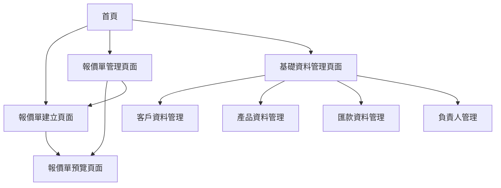

# 報價單系統產品需求文件

## 1. 產品概述

本系統是一個智能化的報價單管理系統，旨在幫助企業快速生成專業的報價單文件。系統提供預設的客戶資料、產品資料、匯款資料和專案負責人資料庫，透過下拉選單的方式讓使用者能夠快速選擇並組合生成報價單，大幅提升工作效率。

目標是為中小企業提供一個簡單易用、功能完整的報價單管理解決方案，減少重複性工作並提高報價單的專業度和準確性。

## 2. 核心功能

### 2.1 使用者角色

| 角色 | 註冊方式 | 核心權限 |
|------|----------|----------|
| 管理員 | 系統預設帳號 | 可管理所有基礎資料、使用者帳號、系統設定 |
| 一般使用者 | 管理員邀請註冊 | 可建立報價單、查看自己的報價單記錄 |

### 2.2 功能模組

我們的報價單系統包含以下主要頁面：

1. **首頁**：系統概覽、快速操作入口、最近報價單列表
2. **報價單建立頁面**：報價單編輯器、即時預覽、儲存功能
3. **報價單管理頁面**：報價單列表、搜尋篩選、批量操作
4. **基礎資料管理頁面**：客戶資料、產品資料、匯款資料、負責人資料管理
5. **報價單預覽頁面**：完整報價單顯示、列印、匯出功能

### 2.3 頁面詳細功能

| 頁面名稱 | 模組名稱 | 功能描述 |
|----------|----------|----------|
| 首頁 | 系統概覽 | 顯示系統統計資訊、最近建立的報價單、快速操作按鈕 |
| 首頁 | 快速操作 | 提供新增報價單、查看報價單列表、管理基礎資料的快速入口 |
| 報價單建立頁面 | 基本資訊區塊 | 客戶選擇下拉選單、聯絡人選擇、報價日期設定、有效期限設定 |
| 報價單建立頁面 | 產品明細區塊 | 產品選擇下拉選單、數量輸入、單位選擇、單價設定、金額自動計算 |
| 報價單建立頁面 | 費用計算區塊 | 小計計算、稅率設定、稅金計算、總計顯示 |
| 報價單建立頁面 | 備註資訊區塊 | 合約條款、付款方式、專案負責人選擇、其他備註 |
| 報價單建立頁面 | 即時預覽 | 即時顯示報價單格式、支援列印預覽 |
| 報價單管理頁面 | 報價單列表 | 分頁顯示所有報價單、狀態標示、操作按鈕 |
| 報價單管理頁面 | 搜尋篩選 | 依客戶名稱、日期範圍、狀態、負責人進行篩選 |
| 報價單管理頁面 | 批量操作 | 批量刪除、批量匯出、狀態批量更新 |
| 基礎資料管理頁面 | 客戶資料管理 | 新增、編輯、刪除客戶資訊（公司名稱、聯絡人、電話、地址等） |
| 基礎資料管理頁面 | 產品資料管理 | 新增、編輯、刪除產品資訊（產品名稱、描述、預設單價、單位等） |
| 基礎資料管理頁面 | 匯款資料管理 | 新增、編輯、刪除銀行帳戶資訊（銀行名稱、帳號、戶名等） |
| 基礎資料管理頁面 | 負責人管理 | 新增、編輯、刪除專案負責人資訊（姓名、職稱、聯絡方式等） |
| 報價單預覽頁面 | 完整顯示 | 以正式報價單格式完整顯示所有資訊 |
| 報價單預覽頁面 | 列印功能 | 支援瀏覽器列印、頁面格式最佳化 |
| 報價單預覽頁面 | 匯出功能 | 支援PDF匯出、Excel匯出 |

## 3. 核心流程

### 一般使用者流程
1. 登入系統後進入首頁
2. 點擊「新增報價單」進入建立頁面
3. 依序選擇客戶資料、填寫產品明細、設定費用資訊
4. 即時預覽報價單格式，確認無誤後儲存
5. 可選擇直接列印或匯出PDF
6. 在報價單管理頁面查看和管理所有報價單

### 管理員流程
1. 登入系統後可進入基礎資料管理
2. 維護客戶資料、產品資料、匯款資料、負責人資料
3. 管理使用者帳號和權限
4. 查看系統使用統計和報表

## 4. 使用者介面設計

### 4.1 設計風格
- **主要色彩**：#2563eb（藍色）作為主色調，#f8fafc（淺灰）作為背景色
- **次要色彩**：#10b981（綠色）用於成功狀態，#ef4444（紅色）用於警告狀態
- **按鈕樣式**：圓角設計（border-radius: 6px），具有懸停效果和陰影
- **字體**：優先使用系統字體，中文使用微軟正黑體或蘋方，英文使用 Inter 或 Roboto
- **字體大小**：標題 24px，副標題 18px，內文 14px，小字 12px
- **版面風格**：卡片式設計，清晰的區塊分割，頂部導航列
- **圖示風格**：使用 Heroicons 或 Lucide 圖示庫，保持一致的線條風格

### 4.2 頁面設計概覽

| 頁面名稱 | 模組名稱 | UI 元素 |
|----------|----------|----------|
| 首頁 | 系統概覽 | 統計卡片（白色背景、陰影效果）、圖表區域、快速操作按鈕組 |
| 首頁 | 導航列 | 頂部固定導航、Logo、使用者選單、主要功能連結 |
| 報價單建立頁面 | 表單區域 | 分步驟表單設計、下拉選單使用 Select 元件、即時驗證提示 |
| 報價單建立頁面 | 預覽區域 | 右側固定預覽面板、即時更新、可摺疊設計 |
| 報價單管理頁面 | 資料表格 | 響應式表格、分頁控制、排序功能、操作按鈕組 |
| 報價單管理頁面 | 篩選區域 | 摺疊式篩選面板、日期選擇器、多選下拉選單 |
| 基礎資料管理頁面 | 標籤頁設計 | 頂部標籤切換、每個標籤對應一種資料類型 |
| 基礎資料管理頁面 | CRUD 介面 | 新增按鈕、編輯模態視窗、刪除確認對話框 |
| 報價單預覽頁面 | 列印版面 | A4 紙張比例、列印友善的 CSS 樣式、頁首頁尾設計 |

### 4.3 響應式設計
本系統採用桌面優先的響應式設計，主要針對桌面和平板使用者最佳化。在平板裝置上，側邊欄會摺疊為漢堡選單，表格會採用卡片式佈局以提升觸控體驗。手機端提供基本的查看功能，但建議使用桌面或平板進行報價單編輯作業。